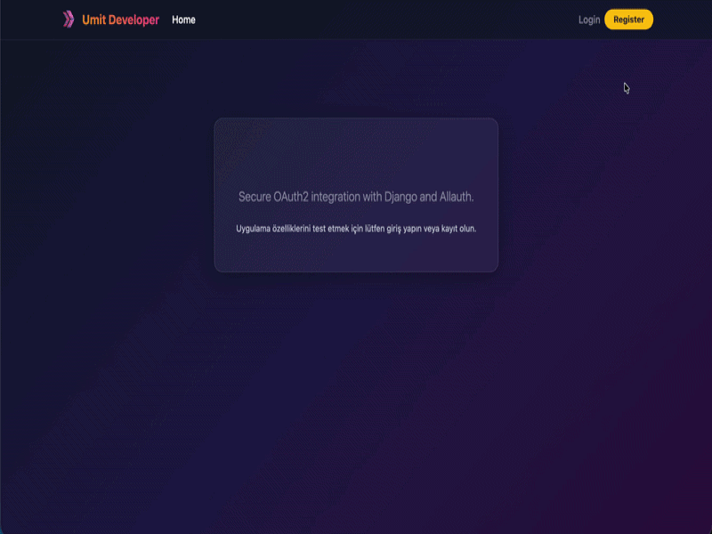

<p align="center">
  
  
        
  
  
</p>

<h1 align="center">🔐 Django Google Allauth Integration</h1>

<p align="center"><strong>A professional, production-ready implementation of Google OAuth2 social authentication featuring a sleek, responsive Glassmorphism user interface 🚀</strong></p>

<div align="center">
  <h3>
    <a href="https://umit8110.pythonanywhere.com">
      🖥️ Live Demo
    </a>
     | 
    <a href="https://github.com/umitarat-dev/django-google-allauth-integration.git">
      📂 Repository
    </a>
  </h3>
</div>

<p align="center">
  <a href="https://umit8110.pythonanywhere.com">
    
  </a>
</p>

## 📚 Navigation
- [🚀 Live Application](#-live-application)
- [📦 Key Features](#-key-features)
- [🛠️ Built With](#️-built-with)
- [⚙️ Setup & Installation](#️-setup--installation)
- [🔑 Google API Configuration](#-google-api-configuration)
- [📬 Contact Information](#-contact-information)

## 🚀 Live Application
The web application is fully deployed and active on production. You can test both the social authentication workflow and the native credential system.
* **Production URL:** [https://umit8110.pythonanywhere.com](https://umit8110.pythonanywhere.com)

> **Pro Tip:** When logging in via Google, the application securely retrieves the user's social profile details and gracefully renders their avatar inside the dynamic navigation bar.

## 📦 Key Features
* **Google Social Authentication:** Secure, one-click login and registration engine powered by `django-allauth`.
* **Hybrid Auth System:** Seamless fallback supporting traditional username/password registrations with real-time Django messages/notifications.
* **Sleek Glassmorphism UI:** Fully customized frontend built with Bootstrap 5 and modern CSS blur filters (`backdrop-filter`) for a premium visual feel.
* **Intelligent Responsive Navbar:** Custom mobile layout optimization where main site navigation links align to the left, while authentication/profile controls snap perfectly to the right side of the hamburger menu.
* **Security Best Practices:** Environment-aware structure keeping confidential credentials (`SECRET_KEY`, Google Client IDs) heavily decoupled via `python-decouple`.
* **Production-Ready Deployment:** Native alignment with PythonAnywhere deployment standards, including automated static file bundling via `collectstatic`.


## 🛠️ Built With
* **Framework:** [Django 5.1](https://www.djangoproject.com/) (Python 3.10+)
* **Social Authentication:** [django-allauth](https://django-allauth.readthedocs.io/)
* **Form Layouts:** [django-crispy-forms](https://django-crispy-forms.readthedocs.io/) & [crispy-bootstrap5](https://github.com/django-crispy-forms/crispy-bootstrap5)
* **Frontend:** [Bootstrap 5](https://getbootstrap.com/) & Custom CSS3


## ⚙️ Setup & Installation

### Option 1: Local Development (macOS/Linux/Windows)

#### 1. Clone the Repository & Initialize Environment
```bash
git clone [https://github.com/umitarat-dev/django-google-allauth-integration.git](https://github.com/umitarat-dev/django-google-allauth-integration.git)
cd django-google-allauth-integration

# Setup Virtual Environment
python3 -m venv env
source env/bin/activate  # Windows: env\Scripts\activate
```

#### 2. Install Dependencies

```bash
pip install -r requirements.txt
```

#### 3. Environment Configuration
Create a `.env` file in the root directory of the project:

```bash
SECRET_KEY=your_secure_django_secret_key
DEBUG=True
ALLOWED_HOSTS=127.0.0.1,localhost
GOOGLE_CLIENT_ID=your_google_client_id_here
GOOGLE_SECRET=your_google_client_secret_here
```

#### 4. Run Migrations & Start Server
Create a `.env` file in the root directory of the project:

```bash
python manage.py migrate
python manage.py runserver
```

Navigate to `http://127.0.0.1:8000/` to explore the application locally.

### Option 2: Production (PythonAnywhere Deployment)
- The project settings are decoupled and pre-configured for live tracking. Ensure `STATIC_ROOT = BASE_DIR / 'staticfiles'` is active and mapped properly inside the PythonAnywhere Web tab.


## 🔑 Google API Configuration
- To make Google Social Login functional in your own environment, follow these steps:

1. Go to the Google Cloud Console and create a new project.

2. Configure your OAuth Consent Screen settings.

3. Navigate to the Credentials tab, click Create Credentials, and select OAuth client ID.

4. Set the application type to Web Application and add your redirect URIs:
  - Local URI: `http://127.0.0.1:8000/accounts/google/login/callback/`

  - Production URI: `https://umit8110.pythonanywhere.com/accounts/google/login/callback/`

5. Copy your generated `Client ID` and `Client Secret` into your local or production `.env` file.


## 📬 Contact Information

I am open to discussing backend architecture, API design, and professional collaborations.

* **LinkedIn:** [linkedin.com/in/umit-arat](https://www.linkedin.com/in/umit-arat/)
* **Email:** [umitarat8098@gmail.com](mailto:umitarat8098@gmail.com)
* **GitHub:** [github.com/umitarat-dev](https://github.com/umitarat-dev) (Current Workspace)
